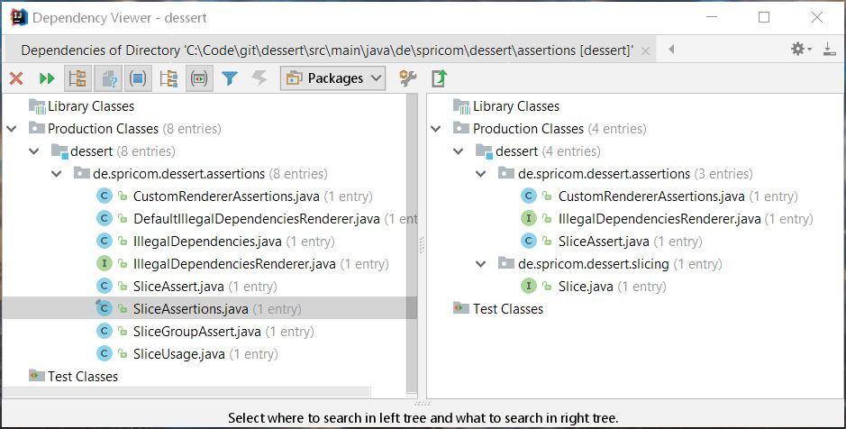
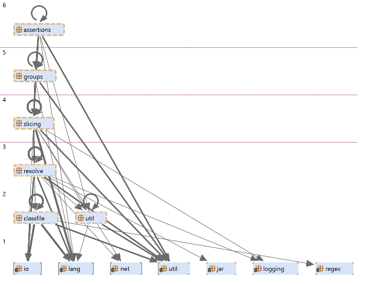

## &nbsp;

# Marktübersicht

Welche Hilfestellungen gibt es?

--

## Module

- Ein Projekt in mehrere Teilprojekte mit definierten Abhängigkeiten aufteilen
- Multi-Module Projekte mit Maven oder Gradle
 
Dabei kommt es auf die richtige Granularität an!

**Nachteile:**
- Änderung bestehender Komponentenarchitektur schwierig
- Vermischung von Ebenen/Zuständigkeiten

--

## Java 9 Module

module-info.java:

    open module com.example.foo {
        requires com.example.foo.http;
        requires java.logging;
    
        requires transitive com.example.foo.network;
     
        exports com.example.foo.bar;
        exports com.example.foo.internal to com.example.foo.probe;
    
        uses com.example.foo.spi.Intf;
        provides com.example.foo.spi.Intf with com.example.foo.Impl;
    }

Quelle: https://docs.oracle.com/javase/specs/jls/se9/html/jls-7.html#jls-7.7

- Berücksichtigt auch Laufzeitabhängigkeiten
- Granularität: Packages

--

## Build-Tools

Maven [maven-dependency-plugin](https://maven.apache.org/plugins/maven-dependency-plugin/source-repository.html)
- mvn dependendcy:analyze
- mvn dependendcy:tree
  
Gradle
- [gradle-dependency-analyze](https://stackoverflow.com/questions/48377905/is-there-a-gradle-plugin-equivalent-of-mvn-dependencyanalyze)

--

## jdeps (seit JDK 8)

Der Aufruf von

    jdeps -v spring-batch-core-4.0.0.RELEASE.jar 

liefert (JDK 9):

    spring-batch-core-4.0.0.RELEASE.jar -> java.base
    spring-batch-core-4.0.0.RELEASE.jar -> java.desktop
    spring-batch-core-4.0.0.RELEASE.jar -> java.sql
    spring-batch-core-4.0.0.RELEASE.jar -> java.xml
    spring-batch-core-4.0.0.RELEASE.jar -> java.xml.ws.annotation
    spring-batch-core-4.0.0.RELEASE.jar -> not found
       org.springframework.batch.core.BatchStatus         -> java.lang.Class                                    java.base
       org.springframework.batch.core.BatchStatus         -> java.lang.Enum                                     java.base
       org.springframework.batch.core.BatchStatus         -> java.lang.Object                                   java.base
       org.springframework.batch.core.BatchStatus         -> java.lang.String                                   java.base
       org.springframework.batch.core.BatchStatus         -> javax.batch.runtime.BatchStatus                    not found
       org.springframework.batch.core.ChunkListener       -> java.lang.Object                                   java.base
       org.springframework.batch.core.ChunkListener       -> java.lang.String                                   java.base
       org.springframework.batch.core.ChunkListener       -> org.springframework.batch.core.StepListener        spring-batch-core-4.0.0.RELEASE.jar
       org.springframework.batch.core.ChunkListener       -> org.springframework.batch.core.scope.context.ChunkContext spring-batch-core-4.0.0.RELEASE.jar
       org.springframework.batch.core.DefaultJobKeyGenerator -> java.io.UnsupportedEncodingException               java.base
       org.springframework.batch.core.DefaultJobKeyGenerator -> java.lang.IllegalStateException                    java.base
       org.springframework.batch.core.DefaultJobKeyGenerator -> java.lang.Object                                   java.base
       org.springframework.batch.core.DefaultJobKeyGenerator -> java.lang.String                                   java.base
       org.springframework.batch.core.DefaultJobKeyGenerator -> java.lang.StringBuilder                            java.base
       org.springframework.batch.core.DefaultJobKeyGenerator -> java.math.BigInteger                               java.base
       org.springframework.batch.core.DefaultJobKeyGenerator -> java.security.MessageDigest                        java.base
       org.springframework.batch.core.DefaultJobKeyGenerator -> java.security.NoSuchAlgorithmException             java.base
       org.springframework.batch.core.DefaultJobKeyGenerator -> java.util.ArrayList                                java.base
       org.springframework.batch.core.DefaultJobKeyGenerator -> java.util.Collection                               java.base
       org.springframework.batch.core.DefaultJobKeyGenerator -> java.util.Collections                              java.base
       org.springframework.batch.core.DefaultJobKeyGenerator -> java.util.Iterator                                 java.base
       org.springframework.batch.core.DefaultJobKeyGenerator -> java.util.List                                     java.base
       org.springframework.batch.core.DefaultJobKeyGenerator -> java.util.Map                                      java.base
       org.springframework.batch.core.DefaultJobKeyGenerator -> java.util.Set                                      java.base
       org.springframework.batch.core.DefaultJobKeyGenerator -> org.springframework.batch.core.JobKeyGenerator     spring-batch-core-4.0.0.RELEASE.jar
       org.springframework.batch.core.DefaultJobKeyGenerator -> org.springframework.batch.core.JobParameter        spring-batch-core-4.0.0.RELEASE.jar
       org.springframework.batch.core.DefaultJobKeyGenerator -> org.springframework.batch.core.JobParameters       spring-batch-core-4.0.0.RELEASE.jar

--

## IDE's

- IntelliJ IDEA 'Analyze Dependencies ...'

 
--

## Kommerzielle Tools

- [Sonargraph-Architect](https://www.hello2morrow.com/products/sonargraph/architect9)
- [Structure101](http://structure101.com/)

Komplexe UI für Softwareanalyse nach vielfältigen Kriterien (Reports, Visualisierung, Refactoring).

--

## Opensource-Tools

- [Dependometer](https://sourceforge.net/projects/dependometer/)
- [Class Dependency Analyzer (CDA)](http://www.dependency-analyzer.org/)
- [JDepend (mit Plugins für Eclipse/Maven/etc.)](http://mcs.une.edu.au/doc/jdepend/docs/JDepend.html)
- [degraph von Jens Schauder](http://blog.schauderhaft.de/degraph/)
- und weitere...

