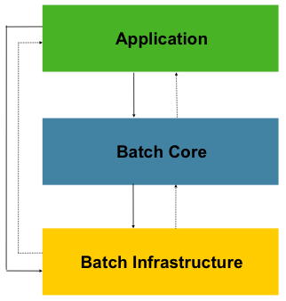
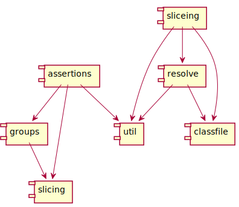
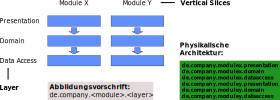

# Wie alles begann ...

Ausgangssituation:

- 2002
- EJB 2.0 (OC4J)
- Webanwendung mit JSP's (später Struts)
- JBuilder, später Eclipse

--

Probleme
- Unittests sehr aufwendig
  - Umfangreiches Setup
  - Für Tests musste immer die ganze Anwendung lauffähig sein
  - Tests waren sehr fragil und mussten ständig angepasst werden
  - Lange Laufzeiten
- Wiederverwendung von Komponenten schwierig
  - Ein Source-Repository (ein Projekt in der IDE)
  - Viele IF/ELSE
  - Ganze Sourcezweige wurden kopiert

Note: Suppy-Chain-Lösung (Lieferantenportal, Verschiffung), später Handwerkerportal

--

Dann kam ein Berater...

Ursachen
  - Packages nach Inhalten sortiert
  - Unklare Zuordnung von Packages zu Funktionsblöcken
  - Abhängigkeiten nicht klar definiert
  - Zirkuläre Abhängigkeiten
  - Hotspot

Note: Valtech mit Dependometer, Funktionsblöcke und Abhängigkeiten mussten als XML definiert werden

--

Wie es weiterging...
  - Umfangreiches Refactoring
  - CI (Report hat keiner beachtet)

---

Was ist strukturelle Architektur

--

## Spring Batch Layered Architecture

    
    
Relaxed Layered Architecture

--

## Dessert Bausteine und Abhängigkeiten

--

- Was ist strukturelle Architektur
  - Schichten
  - Vertical Slices
  - Funktionsblöcke
  - Abhängigkeiten
- Was ist physikalische Architektur
  - Tatsächliche Packagestruktur und deren Abhängigkeiten
  - Abbildungsvorschrift: 
    com.anderscore.<product>.<vertial-slice>.<layer>.<module>
  - Abhängigkeiten entweder nach oben oder nach unten (nie beides)

Note: Begriffe von Valtech

--

## Strukturelle Architektur

--

Aufwand: Zähneputzen

--

# Sünden/Bad Smells

Problem mit zirkulären Abhängigkeiten

--

# Hotspot

Von einer zentralen Klasse kann man alles aufrufen
==> Diese Klasse wird überall verwendet

Lösung: Registry + Events

(erfordert mehrere statt einer Klasse und Interfaces)

--

# Packages nach Inhalt sortiert

- entities
- daos
- enums
- CommonConstants
- utils mit Abhängigkeiten

---

# Marktübersicht

- Dependometer von Valtech (https://sourceforge.net/projects/dependometer/)
- Diverse Open-Source Tools zur Visualisierung von Abhängigkeiten (https://dzone.com/articles/dependency-analysis-and-1)
- JDepend (mit Plugins für Eclipse/Maven/etc.) (http://mcs.une.edu.au/doc/jdepend/docs/JDepend.html)
- JDeps (seit JDK8)
- degraph von Jens Schauder (http://blog.schauderhaft.de/degraph/)

--

## Grafische Tools: 
- Sonargraph-Architect (https://www.hello2morrow.com/products/sonargraph/architect9)
- Structure101 (http://structure101.com/)

--

Alternative Produkte

- maven dependendcy:analyze
  - https://maven.apache.org/plugins/maven-dependency-plugin/source-repository.html
  - https://github.com/apache/maven-dependency-analyzer/tree/maven-dependency-analyzer-1.8 (verwendet ASM)