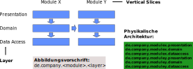

## &nbsp;

# Was ist 
# strukturelle 
# Architektur?

--

## Spring Batch Layered Architecture

    
    
Relaxed Layered Architecture

--

## Dessert Bausteine und Abhängigkeiten

--

## &nbsp;

# Strukturelle Architektur

  - Schichten
  - Vertical Slices
  - Funktionsblöcke
  - Abhängigkeiten

Note: Begriffe von Valtech

--

## Strukturelle Architektur

--

## &nbsp;

# Sünden (Bad Smells)

--

## Packages nach Inhalt sortiert

Indikatoren:
- Top-Level Packages
  - entities
  - daos
  - enums
- Klasse CommonConstants
- util Package mit Abhängigkeiten

--

## Zirkuläre Abhängigkeiten

--

## Hotspot

Von einer zentralen Klasse kann man alles aufrufen
==> Diese Klasse wird überall verwendet

Lösung: Registry + Events

(erfordert mehrere statt einer Klasse und Interfaces)

--

Aufwand: Zähneputzen

