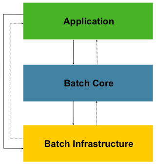
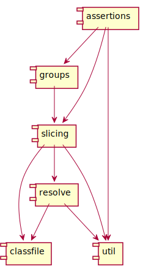

## &nbsp;

# Was ist 
# strukturelle 
# Architektur?

--

## Spring Batch Layered Architecture

    
    
Relaxed Layered Architecture

--

## Dessert Bausteine und Abhängigkeiten

--

## &nbsp;

# Strukturelle Architektur

  - Schichten
  - Vertical Slices
  - Funktionsblöcke
  - Abhängigkeiten

Note: Begriffe von Valtech

--

## Strukturelle Architektur

--

## &nbsp;

# Sünden (Bad Smells)

--

## Packages nach Inhalt sortiert

Indikatoren:
- Top-Level Packages
  - entities
  - daos
  - enums
- Klasse CommonConstants
- util Package mit Abhängigkeiten

--

## Zirkuläre Abhängigkeiten

    
    

--

## Hotspot

Von einer zentralen Klasse kann man alles aufrufen

&rArr; Diese Klasse wird überall verwendet

An der Commit-History zu erkennen

Lösung: Registry + Events 
(erfordert Interfaces und mehrere Klassen statt einer Klasse)

--

## Wie Zähneputzen...

Man muss etwas dafür tun, hat aber keinen unmittelbaren nutzen.

 <!-- .element: height="500" -->

Quelle: https://pixabay.com/de/mann-spiegel-zahn-blau-badezimmer-2166254/

