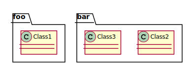

## Abgrenzung/Einordnung (Flughöhe)

<table>
<tr><td></td><td>IT Strategie (Blech oder Cloud)</td></tr>
<tr><td></td><td>Systeme/Produkte</td></tr>
<tr><td></td><td>Microservices</td></tr>
<tr><td></td><td>Komponenten</td></tr>
<tr><td></td><td>Klassen und Pakete</td></tr>
<tr><td></td><td>Code</td></tr>
</table>

--

## &nbsp; 

# Wie alles begann ...

#### Ausgangssituation:

- 2002
- EJB 2.0 (OC4J)
- Webanwendung mit JSP's (später Struts)
- JBuilder, später Eclipse

--

## Probleme

- Unittests sehr aufwendig
  - Umfangreiches Setup
  - Für Tests musste immer die ganze Anwendung lauffähig sein
  - Tests waren sehr fragil und mussten ständig angepasst werden
  - Lange Laufzeiten
- Wiederverwendung von Komponenten schwierig
  - Ein Source-Repository (ein Projekt in der IDE)
  - Viele IF/ELSE
  - Ganze Sourcezweige wurden dupliziert

Note: Suppy-Chain-Lösung (Lieferantenportal, Verschiffung), später Handwerkerportal

--

## Dann kam ein Berater (mit einem Tool)...

Identifzierte Problemursachen
  - Packages nach Inhalten sortiert
  - Unklare Zuordnung von Packages zu Funktionsblöcken
  - Abhängigkeiten nicht klar definiert
  - Zirkuläre Abhängigkeiten
  - Hotspot (eine Klasse, um die sich alle rangeln)

Note: Valtech mit Dependometer, Funktionsblöcke und Abhängigkeiten mussten als XML definiert werden

--

## Wie es weiterging...

  - Umfangreiches Refactoring
  - CI (Report hat später keiner mehr beachtet)
